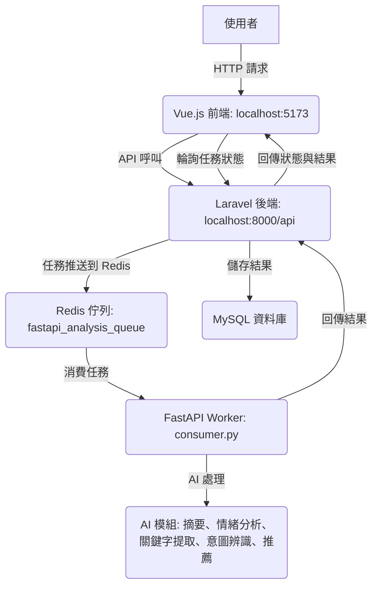

# InsightFlow 專案說明文件

> **InsightFlow: An AI-powered customer feedback analyzer built with Laravel, FastAPI, and Vue 3.**

## 專案概述
InsightFlow 是一個整合前端與後端的智慧分析平台，專為處理顧客意見與反饋設計，透過 AI 技術提供摘要、情緒分析、關鍵字提取、意圖辨識與推薦建議。專案採用微服務架構，包含 Laravel 後端、FastAPI AI 工作處理器，以及 Vue.js 前端，搭配 Docker 容器化部署，確保高效能與可擴展性。我們的目標是提供一個穩定且易於維護的系統，讓使用者能快速提交分析任務並查看結果。

## 功能特色
- **顧客意見分析**：使用者可輸入文字內容，系統自動進行摘要、情緒分析、關鍵字提取與意圖辨識。
- **異步任務處理**：透過 Redis 佇列實現 Laravel 與 FastAPI 的解耦，確保高效能任務處理。
- **直觀前端介面**：使用 Vue.js 打造簡潔易用的儀表板，支援任務提交與即時狀態更新。
- **容器化部署**：透過 Docker Compose 整合所有服務（Laravel、FastAPI、Vue.js、MySQL、Redis），方便開發與部署。
- **模組化 AI 設計**：FastAPI 工作處理器採用策略模式，AI 模組設計為動態可插拔架構，新增或替換摘要、情緒分析等模組無需修改核心流程，僅需註冊對應策略類別，極具擴展性。例如，開發者可輕鬆將 GPT 模組替換為 LLaMA 或新增自定義分析模組，提升系統靈活性。
- **測試支援**：包含 Laravel 與 FastAPI 的單元與整合測試，確保程式碼品質。

## 系統架構圖
以下是 InsightFlow 的系統架構圖，展示各服務之間的互動流程：



**說明**：
- **Vue.js 前端**：提供使用者介面，負責任務提交與結果展示，透過 Axios 與 Laravel API 互動。
- **Laravel 後端**：處理 API 請求，儲存任務資料到 MySQL，並將任務推送到 Redis 佇列。
- **FastAPI Worker**：監聽 Redis 佇列，執行 AI 分析任務，並將結果回傳至 Laravel。
- **Redis 佇列**：作為 Laravel 與 FastAPI 的通訊橋樑，實現異步處理。
- **MySQL 資料庫**：儲存任務資料與分析結果。
- **AI 模組**：支援多種模型（例如 GPT、HuggingFace），用於摘要、情緒分析等功能，透過策略模式實現靈活切換。

## 環境需求
- **Docker**：需安裝 Docker 與 Docker Compose 以運行容器化服務。
- **Node.js**：前端開發時需用於安裝依賴（若不使用 Docker，可直接執行 `npm install`）。
- **PHP & Composer**：後端開發時需用於 Laravel（若不使用 Docker）。
- **Python 3.10**：FastAPI Worker 依賴（若不使用 Docker）。

## 安裝與執行
以下步驟假設您已安裝 Docker 與 Docker Compose，若無，請先參考官方文件安裝。

1. **複製專案**：
   ```bash
   git clone https://github.com/BpsEason/insight_flow_project.git
   cd insight_flow_project
   ```

2. **設定環境變數**：
   - 複製 `.env.example` 為 `.env`：
     ```bash
     cp .env.example .env
     ```
   - 編輯 `.env` 文件，填入以下必要變數：
     - `OPENAI_API_KEY`：您的 OpenAI API 金鑰。
     - `HUGGINGFACE_API_TOKEN`：您的 HuggingFace API 金鑰。
     - `APP_KEY`：Laravel 應用程式金鑰（可透過 `make all` 自動生成）。
     - 確認其他變數（如資料庫、Redis 配置）是否符合需求。

3. **建置與啟動服務**：
   - 執行以下指令，建置並啟動所有服務（首次建置可能需較長時間）：
     ```bash
     make all
     ```
   - 此指令會：
     - 建置 Docker 映像（Laravel、FastAPI、Vue.js）。
     - 啟動所有容器（包括私のSQL、Redis）。
     - 自動生成 Laravel 的 `APP_KEY` 並執行資料庫遷移。

4. **訪問應用**：
   - **前端**：開啟瀏覽器，訪問 [http://localhost:5173](http://localhost:5173)。
   - **FastAPI API 文件**（健康檢查或同步測試）：[http://localhost:8001/docs](http://localhost:8001/docs)。
   - **Laravel API**（若需直接測試）：[http://localhost:8000/api](http://localhost:8000/api)。

5. **其他常用指令**：
   - 停止服務：`make stop`
   - 移除容器與映像：`make clean`
   - 執行 Laravel 測試：`make test_laravel`
   - 執行 FastAPI 測試：`make test_worker`
   - 執行前端 ESLint 檢查：`make test_frontend`

## 使用方式
1. 開啟前端介面 ([http://localhost:5173](http://localhost:5173))。
2. 在「提交新分析任務」區塊輸入文字（例如：「顧客抱怨胃部不適，希望有促銷方案。」）。
3. 提交後，系統會自動建立任務並顯示任務 ID 與狀態。
4. 任務狀態會透過輪詢自動更新（每 3 秒），直到完成或失敗。
5. 完成後，結果將展示摘要、情緒分數、關鍵字、意圖與推薦建議。

### 分析任務輸入/輸出範例
以下是提交分析任務的輸入與輸出 JSON 範例，幫助開發者快速理解 API 格式與結果結構：

**輸入範例**（POST `/api/analysis/submit`）：
```json
{
  "text_content": "顧客抱怨胃部不適，希望有促銷方案。"
}
```

**回應範例**（成功提交，202 Accepted）：
```json
{
  "message": "分析任務已提交，請稍後查詢結果。",
  "task_id": "550e8400-e29b-41d4-a716-446655440000"
}
```

**查詢狀態範例**（GET `/api/analysis/{task_id}/status`）：
```json
{
  "task_id": "550e8400-e29b-41d4-a716-446655440000",
  "status": "completed",
  "result": {
    "analysis_output": {
      "摘要": ["主要問題為「胃部不適與促銷需求」。"],
      "推薦": ["觸發自動推薦「腸胃照護」商品模組。", "促銷訊息應優先展示在首頁。"],
      "情緒分數": {"label": "negative", "score": 0.95},
      "關鍵字": ["胃部不適", "促銷方案"],
      "意圖": {"intent": "健康問題諮詢", "product_category": "腸胃照護產品"}
    }
  },
  "input_data": "顧客抱怨胃部不適，希望有促銷方案。",
  "created_at": "2025-06-23T12:00:00Z",
  "updated_at": "2025-06-23T12:01:30Z"
}
```

## 關鍵代碼說明
以下是專案中核心功能的代碼片段及其說明，展示系統如何實現前端到後端的完整流程。

### 1. **Vue 前端：任務提交與狀態輪詢**
檔案：`vue-frontend/src/stores/analysis.js`

```javascript
import { defineStore } from 'pinia';
import axios from 'axios';

const API_BASE_URL = import.meta.env.VITE_APP_API_URL || 'http://localhost:8000/api';

export const useAnalysisStore = defineStore('analysis', {
  state: () => ({
    currentTask: null,
    tasks: [],
    loading: false,
    error: null,
  }),
  actions: {
    async submitAnalysis(textContent) {
      this.loading = true;
      this.error = null;
      try {
        const response = await axios.post(`${API_BASE_URL}/analysis/submit`, { text_content: textContent });
        this.currentTask = {
          id: response.data.task_id,
          status: 'pending',
          input_data: textContent,
          result: null,
          createdAt: new Date().toISOString(),
        };
        this.tasks.unshift(this.currentTask);
        this.loading = false;
        return this.currentTask.id;
      } catch (err) {
        this.error = '提交任務失敗: ' + (err.response?.data?.message || err.message);
        this.loading = false;
        throw err;
      }
    },
    async fetchTaskStatus(taskId) {
      this.loading = true;
      try {
        const response = await axios.get(`${API_BASE_URL}/analysis/${taskId}/status`);
        const taskIndex = this.tasks.findIndex(t => t.id === taskId);
        if (taskIndex !== -1) {
          this.tasks[taskIndex].status = response.data.status;
          this.tasks[taskIndex].result = response.data.result;
          this.tasks[taskIndex].input_data = response.data.input_data;
        }
        this.loading = false;
        return response.data;
      } catch (err) {
        this.error = '查詢任務狀態失敗: ' + (err.response?.data?.message || err.message);
        this.loading = false;
        throw err;
      }
    },
  },
});
```

**說明**：
- 使用 Pinia 作為狀態管理工具，負責與 Laravel API 的交互。
- `submitAnalysis`：透過 Axios 發送 POST 請求到 `/api/analysis/submit`，提交分析任務並儲存任務 ID。
- `fetchTaskStatus`：透過 GET 請求到 `/api/analysis/{taskId}/status`，取得任務狀態與結果。
- 前端透過 `setInterval` 每 3 秒輪詢任務狀態（見 `Dashboard.vue`），直到任務完成或失敗。

### 2. **Laravel 後端：任務提交與佇列分發**
檔案：`laravel-backend/app/Http/Controllers/Api/AnalysisController.php`

```php
<?php
namespace App\Http\Controllers\Api;

use App\Http\Controllers\Controller;
use App\Http\Requests\CreateAnalysisRequest;
use App\Jobs\ProcessAnalysisTask;
use App\Models\AnalysisTask;
use Illuminate\Support\Str;
use Illuminate\Support\Facades\Log;

class AnalysisController extends Controller
{
    public function submitAnalysis(CreateAnalysisRequest $request)
    {
        try {
            $task = AnalysisTask::create([
                'uuid' => (string) Str::uuid(),
                'user_id' => null,
                'input_data' => $request->input('text_content'),
                'status' => 'pending',
                'result' => null,
            ]);

            ProcessAnalysisTask::dispatch($task->uuid, $request->input('text_content'));

            Log::info("Analysis task submitted: " . $task->uuid);

            return response()->json([
                'message' => '分析任務已提交，請稍後查詢結果。',
                'task_id' => $task->uuid,
            ], 202);
        } catch (\Exception $e) {
            Log::error("Failed to submit analysis task: " . $e->getMessage());
            return response()->json(['error' => 'Failed to initio task', 'details' => $e->getMessage()], 500);
        }
    }
}
```

檔案：`laravel-backend/app/Jobs/ProcessAnalysisTask.php`

```php
<?php
namespace App\Jobs;

use Illuminate\Bus\Queueable;
use Illuminate\Contracts\Queue\ShouldQueue;
use Illuminate\Foundation\Bus\Dispatchable;
use Illuminate\Queue\InteractsWithQueue;
use Illuminate\Queue\SerializesModels;
use Illuminate\Support\Facades\Redis;
use App\Models\AnalysisTask;
use Illuminate\Support\Facades\Log;

class ProcessAnalysisTask implements ShouldQueue
{
    use Dispatchable, InteractsWithQueue, Queueable, SerializesModels;

    protected $taskId;
    protected $textContent;

    public function __construct(string $taskId, string $textContent)
    {
        $this->taskId = $taskId;
        $this->textContent = $textContent;
    }

    public function handle(): void
    {
        $task = AnalysisTask::where('uuid', $this->taskId)->first();
        if (!$task) {
            Log::error("Task {$this->taskId} not found in database for dispatch to FastAPI worker.");
            return;
        }

        try {
            $task->update(['status' => 'queued_for_worker']);
            Redis::rpush(env('REDIS_QUEUE_NAME_FASTAPI', 'fastapi_analysis_queue'), json_encode([
                'task_id' => $this->taskId,
                'text_content' => $this->textContent,
            ]));
            Log::info("Task {$this->taskId} successfully pushed to FastAPI Redis queue.");
        } catch (\Exception $e) {
            $task->update([
                'status' => 'failed_dispatch',
                'result' => ['error' => 'Failed to dispatch to worker queue', 'details' => $e->getMessage()],
            ]);
            Log::error("Failed to push task {$this->taskId} to FastAPI Redis queue: " . $e->getMessage());
        }
    }
}
```

**說明**：
- `AnalysisController::submitAnalysis`：接收前端提交的文字內容，驗證後創建 `AnalysisTask` 模型，並分發 `ProcessAnalysisTask` 任務到 Redis 佇列。
- `ProcessAnalysisTask`：將任務資料（任務 ID 和文字內容）推送到 Redis 的 `fastapi_analysis_queue`，供 FastAPI Worker 消費。
- 使用 Laravel 的佇列系統（`ShouldQueue`）確保任務異步處理，提升後端響應速度。

### 3. **FastAPI Worker：Redis 佇列消費與 AI 處理**
檔案：`fastapi-worker/app/consumer.py`

```python
import redis
import json
import logging
import os
from app.core.insight_flow_core import InsightFlowCore
from app.config import settings
from app.models.request_models import AnalysisRequestPayload
import requests

logging.basicConfig(level=logging.INFO, format='%(asctime)s - %(name)s - %(levelname)s - %(message)s')
logger = logging.getLogger(__name__)

r = redis.Redis(host=settings.REDIS_HOST, port=settings.REDIS_PORT, db=settings.REDIS_DB)
insight_flow = InsightFlowCore({...}) # 初始化 AI 核心

def update_laravel_task_status(task_id: str, status: str, result: dict = None):
    laravel_update_url = os.getenv("LARAVEL_INTERNAL_UPDATE_URL", "http://app/api/internal/analysis/update")
    payload = {"task_id": task_id, "status": status, "result": result}
    try:
        response = requests.post(laravel_update_url, json=payload, timeout=30)
        response.raise_for_status()
        logger.info(f"Successfully updated Laravel for task {task_id} with status {status}")
    except requests.exceptions.RequestException as e:
        logger.error(f"Failed to update Laravel for task {task_id}: {e}")
```

檔案：`fastapi-worker/app/core/insight_flow_core.py`

```python
class InsightFlowCore:
    def __init__(self, config: Dict[str, Any]):
        self.summarizer = self._load_module(config.get("summarizer_model_type"), {
            "gpt_summarizer": GPTSummarizer,
        }, api_key=config.get("OPENAI_API_KEY"))
        self.sentiment_analyzer = self._load_module(config.get("sentiment_model_type"), {
            "hf_sentiment_analyzer": HFSentimentAnalyzer,
        }, model_name=config.get("sentiment_model_name"))
        # ... 其他模組初始化

    def process_customer_feedback(self, user_input: str) -> Dict[str, Any]:
        try:
            summary_output = self.summarizer.summarize(user_input)
            sentiment_score = self.sentiment_analyzer.analyze(user_input)
            keywords = self.keyword_extractor.extract(user_input)
            intent = self.intent_recognizer.recognize(user_input)
            recommendations = self.recommender.generate_recommendations(
                summary=summary_output,
                sentiment=sentiment_score,
                keywords=keywords,
                intent=intent
            )
            return {
                "摘要": summary_output,
                "推薦": recommendations,
                "情緒分數": sentiment_score,
                "關鍵字": keywords,
                "意圖": intent,
            }
        except Exception as e:
            logger.error(f"Error during feedback processing: {e}", exc_info=True)
            raise
```

**說明**：
- `consumer.py`：監聽 Redis 的 `fastapi_analysis_queue`，使用 `brpop` 阻塞式消費任務，解析後交給 `InsightFlowCore` 處理。
- `InsightFlowCore`：採用策略模式，動態加載 AI 模組（摘要、情緒分析等），處理文字輸入並生成結構化結果。模組化設計允許新增或替換模組（如 GPT 改為 LLaMA）只需實現對應策略類別，無需更改核心邏輯。
- 處理完成後，透過 HTTP POST 請求將結果回傳至 Laravel 的 `/api/internal/analysis/update` 端點。

### 4. **Laravel 後端：接收 Worker 回傳結果**
檔案：`laravel-backend/app/Http/Controllers/Api/InternalAnalysisUpdateController.php`

```php
<?php
namespace App\Http\Controllers\Api;

use App\Http\Controllers\Controller;
use App\Models\AnalysisTask;
use Illuminate\Http\Request;
use Illuminate\Support\Facades\Log;
use Illuminate\Validation\ValidationException;

class InternalAnalysisUpdateController extends Controller
{
    public function updateStatus(Request $request)
    {
        try {
            $validatedData = $request->validate([
                'task_id' => 'required|uuid|exists:analysis_tasks,uuid',
                'status' => 'required|string|in:processing,completed,failed',
                'result' => 'nullable|array',
            ]);

            $task = AnalysisTask::where('uuid', $validatedData['task_id'])->first();
            $task->status = $validatedData['status'];
            if (isset($validatedData['result'])) {
                $task->result = $validatedData['result'];
            }
            $task->save();

            Log::info("Internal update: Task {$validatedData['task_id']} updated to status: {$validatedData['status']}");
            return response()->json(['message' => 'Task status updated successfully']);
        } catch (ValidationException $e) {
            Log::error("Internal update validation error: " . $e->getMessage(), ['errors' => $e->errors()]);
            return response()->json(['error' => 'Validation failed', 'details' => $e->errors()], 422);
        } catch (\Exception $e) {
            Log::error("Internal update failed: " . $e->getMessage(), ['exception' => $e]);
            return response()->json(['error' => 'Internal server error', 'details' => $e->getMessage()], 500);
        }
    }
}
```

**說明**：
- 接收 FastAPI Worker 的回傳結果，驗證輸入（任務 ID、狀態、結果）。
- 更新 `AnalysisTask` 模型的狀態與結果，儲存至 MySQL 資料庫。
- 提供錯誤處理與日誌記錄，確保穩定性。

## 專案結構
```
insight_flow_project/
├── laravel-backend/           # Laravel 後端服務
│   ├── app/                  # 應用程式邏輯（控制器、模型、任務）
│   ├── docker/               # Nginx 與 Supervisor 配置
│   ├── routes/               # API 路由
│   ├── tests/                # 功能測試
│   ├── composer.json         # PHP 依賴
│   └── Dockerfile            # Laravel 容器配置
├── fastapi-worker/           # FastAPI AI 工作處理器
│   ├── app/                  # 核心邏輯與模組
│   │   ├── core/            # AI 核心處理（策略模式）
│   │   ├── models/          # Pydantic 模型
│   │   ├── modules/         # AI 模組（摘要、情緒分析等）
│   │   └── consumer.py      # Redis 佇列消費者
│   ├── tests/               # Pytest 測試
│   ├── requirements.txt      # Python 依賴
│   └── Dockerfile           # FastAPI 容器配置
├── vue-frontend/             # Vue.js 前端
│   ├── src/                 # Vue 組件、路由、狀態管理
│   ├── public/              # 靜態資源
│   ├── package.json         # Node.js 依賴
│   └── Dockerfile           # Vue 容器配置
├── docker-compose.yml        # Docker Compose 配置
├── .env.example             # 環境變數範本
└── Makefile                 # 常用指令
```

## 注意事項
- **環境變數安全**：請勿將 `.env` 文件提交至版本控制，確保 API 金鑰安全。
- **AI 模型限制**：目前的 AI 模組為模擬實現，實際部署需替換為真實 API 呼叫。
- **資料庫遷移**：首次執行需確保 `make all` 已完成資料庫遷移，或手動執行：
  ```bash
  docker-compose exec app php artisan migrate
  ```
- **Redis 佇列**：FastAPI Worker 依賴 Redis 進行任務處理，確保 Redis 服務正常運行。
- **前端輪詢**：前端每 3 秒輪詢任務狀態，可根據需求調整間隔。

## 未來改進方向
- 新增認證機制（例如 JWT）以支援多用戶環境。
- 擴展 AI 模組，支援更多模型（如 LLaMA、BERT）或自訂規則。
- 優化前端 UX，新增圖表展示分析結果。
- 加入日誌監控與效能追蹤（例如 Prometheus、Grafana）。
- 支援多語言與國際化（i18n）。

## API 文件
- **FastAPI Worker API 文件**：可透過 [http://localhost:8001/docs](http://localhost:8001/docs) 查看健康檢查與同步分析端點的詳細說明（主要用於測試或除錯）。
- **Laravel API**：主要端點包括 `/api/analysis/submit`（提交任務）與 `/api/analysis/{task_id}/status`（查詢狀態），詳細結構見「分析任務輸入/輸出範例」。

## 常見問題 (FAQ)

### 1. 專案概述與目的
**Q1.1: 請簡要介紹一下 InsightFlow 專案的目標與主要功能。**  
InsightFlow 旨在提供一個 AI 驅動的顧客意見分析平台，透過摘要、情緒分析、關鍵字提取、意圖辨識與推薦建議功能，幫助企業快速理解顧客反饋並制定對應策略。

**Q1.2: InsightFlow 專案主要解決了什麼問題？**  
解決企業難以快速處理大量顧客意見的問題，提供自動化分析工具，提升決策效率。

**Q1.3: 這個專案的「AI 智慧分析」具體指的是什麼？**  
指使用 AI 模型（如 GPT、HuggingFace）對顧客意見進行摘要、情緒分析、關鍵字提取、意圖辨識與生成推薦建議的自動化處理。

### 2. 技術選型與考量
**Q2.1: InsightFlow 為什麼選擇 Laravel、FastAPI 和 Vue.js 這三種技術棧？它們各自在專案中扮演什麼角色？**  
Laravel 負責後端 API 與資料庫管理，FastAPI 處理高效能 AI 分析任務，Vue.js 提供直觀的前端介面，實現前後端分離與高效互動。

**Q2.2: 為什麼採用 Docker 進行容器化部署？它為專案帶來了哪些好處？**  
Docker 確保環境一致性，簡化部署流程，支援跨平台運行，並提升開發與生產環境的可移植性。

**Q2.3: 在專案中，Redis 主要用於什麼目的？為什麼選擇 Redis 而不是其他訊息佇列服務？**  
Redis 用於異步任務佇列，連接 Laravel 與 FastAPI，選擇 Redis 是因為其高效能、簡單配置與可靠的記憶體資料庫特性。

**Q2.4: 專案中的 AI 模組採用了哪些技術（例如 GPT、HuggingFace）？**  
目前模擬使用 GPT 進行摘要、HuggingFace 進行情緒分析等，實際部署需配置真實 API。

**Q2.5: 為什麼選擇 MySQL 作為資料庫？**  
MySQL 提供穩定性、高效能與廣泛支援，適合結構化任務資料與分析結果的儲存需求。

### 3. 系統架構與設計
**Q3.1: 請說明 InsightFlow 的整體系統架構和各服務之間的互動流程。**  
系統採用微服務架構，前端 Vue.js 透過 API 與 Laravel 後端互動，Laravel 將任務推送到 Redis，FastAPI Worker 消費任務並執行 AI 分析，結果回傳 Laravel 並儲存至 MySQL，前端輪詢更新狀態。

**Q3.2: 專案如何實現前後端分離？**  
Vue.js 前端透過 Axios 與 Laravel 的 RESTful API 通信，實現完全獨立的介面與後端邏輯。

**Q3.3: Laravel 和 FastAPI 之間是如何進行異步任務處理的？請描述具體的工作流程。**  
Laravel 透過 `ProcessAnalysisTask` 將任務推送到 Redis 佇列，FastAPI Worker 消費任務，執行 AI 分析後透過 HTTP 請求回傳結果至 Laravel。

**Q3.4: FastAPI Worker 如何確保 AI 模組的「動態可插拔」？請解釋策略模式在此的應用。**  
FastAPI 使用策略模式，透過 `InsightFlowCore` 動態加載模組（如 GPT、HuggingFace），新模組只需實現統一介面並註冊，無需修改核心流程。

**Q3.5: 當 FastAPI Worker 完成分析後，結果是如何回傳給 Laravel 並更新到前端的？**  
FastAPI 透過 POST 請求將結果發送到 Laravel 的 `/api/internal/analysis/update` 端點，Laravel 更新 MySQL，前端透過輪詢獲取最新狀態。

**Q3.6: 前端如何獲取任務的即時狀態更新？**  
前端使用 Pinia 的 `fetchTaskStatus` 每 3 秒輪詢 Laravel 的 `/api/analysis/{task_id}/status` 端點，更新任務狀態與結果。

### 4. 核心功能實現細節
**Q4.1: 顧客意見分析具體包含哪些分析項目？**  
包含摘要、情緒分析、關鍵字提取、意圖辨識與推薦建議。

**Q4.2: 說明一下 Laravel 後端處理任務提交的流程，以及如何將任務推送到 Redis 佇列。**  
前端提交文字至 `/api/analysis/submit`，Laravel 創建 `AnalysisTask` 模型並分發 `ProcessAnalysisTask`，任務透過 Redis 的 `rpush` 推送到 `fastapi_analysis_queue`。

**Q4.3: FastAPI Worker 是如何從 Redis 佇列中消費任務並進行 AI 處理的？**  
FastAPI 使用 `brpop` 從 Redis 佇列獲取任務，解析後交由 `InsightFlowCore` 處理，執行 AI 分析並生成結果。

**Q4.4: 請描述 Laravel 如何接收並處理來自 FastAPI Worker 的內部更新請求。**  
Laravel 的 `/api/internal/analysis/update` 端點接收 FastAPI 的 POST 請求，驗證並更新 `AnalysisTask` 的狀態與結果至 MySQL。

**Q4.5: 前端在提交任務和查詢任務狀態時，使用了哪些 Pinia Store Actions？**  
`submitAnalysis` 提交任務，`fetchTaskStatus` 查詢任務狀態，均透過 Axios 與 Laravel API 互動。

### 5. 部署與開發流程
**Q5.1: 如何快速在本地環境啟動 InsightFlow 專案？`make all` 指令做了哪些事情？**  
執行 `make all` 建置 Docker 映像、啟動容器、生成 Laravel `APP_KEY` 並執行資料庫遷移。

**Q5.2: 專案中的 `.env` 文件主要用於配置哪些重要的環境變數？為什麼強調不要將其提交到版本控制？**  
配置 `OPENAI_API_KEY`、`HUGGINGFACE_API_TOKEN`、`APP_KEY` 等，防止提交以保護敏感資訊。

**Q5.3: 如何查看 FastAPI Worker 的 API 文件？**  
訪問 [http://localhost:8001/docs](http://localhost:8001/docs) 查看 FastAPI 的 Swagger 文件。

**Q5.4: 專案提供了哪些常用的 `make` 指令來協助開發和管理？**  
包括 `make all`（建置啟動）、`make stop`（停止）、`make clean`（清理）、`make test_laravel`（後端測試）、`make test_worker`（FastAPI 測試）、`make test_frontend`（前端檢查）。

**Q5.5: 如果資料庫需要遷移，除了 `make all` 之外，還有什麼手動指令可以執行？**  
執行 `docker-compose exec app php artisan migrate` 進行資料庫遷移。

### 6. 測試與維護
**Q6.1: 專案中包含了哪些測試？如何執行這些測試？**  
包含 Laravel 功能測試、FastAPI Pytest 測試與前端 ESLint 檢查，透過 `make test_laravel`、`make test_worker` 和 `make test_frontend` 執行。

**Q6.2: 在處理異步任務時，你們是如何確保任務失敗時的錯誤處理和日誌記錄的？**  
Laravel 和 FastAPI 使用 try-catch 捕捉錯誤，記錄至日誌，並更新任務狀態為 `failed`，附帶錯誤詳情。

**Q6.3: 未來有哪些改進方向或潛在的功能擴展？**  
包括認證機制、更多 AI 模組、前端圖表、日誌監控與多語言支援。

**Q6.4: 如果需要新增一個 AI 分析模組，例如「實體識別」，開發流程大概會是怎樣的？**  
實現實體識別策略類別，註冊至 `InsightFlowCore`，配置相關參數，無需修改核心流程，測試後部署。
